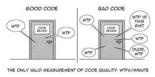

# Clase 03: Estructuras
Fecha: 08/04/2025



* Presentación de  [Estructuras](https://docs.google.com/presentation/d/1qcc_eSXD62mZq0pTigwylDrHAqxhSZKYgstk4NS8vOI/edit?usp=sharing).
* [Enunciado](https://docs.google.com/document/d/1MjuQ911P8dldVOetbVeE1HtvptdvHIKrUxxPXPRetNI/edit?usp=sharing) visto en clases.
* Codigo con todo lo visto en [clase](https://github.com/pdepman/2025-f-estructuras/blob/main/src/Library.hs).
* [Video](https://www.youtube.com/watch?v=bbNHylUzQBM) de naza resolviendo el enunciado  ```que los cumplas```.
* [Apunte](https://docs.google.com/document/d/11C2UAbP70dP7sTID-ZxJm_a-5ypKxQUEuZr6GVk5yFI/edit) Modelado de información.
* [Apunte](https://docs.google.com/document/d/1q2o2zCBU2LOfJs3nWG7-r6SaFHCIU5c0M4CJNmqOIO0/edit) Sistema de tipos.
* [Video](https://www.youtube.com/watch?v=-nxoHX45o48&ab_channel=LucasSpigariol) 32' sobre definición de tipos de datos (clase grabada).

## Tarea
- Quedan los puntos bonus para que los resuelvan en sus casas y repasen lo visto en clase (no se entrega).
- Recuperación de TP1 (para quienes recuperen o deseen practicar):
  - [Enunciado Cerebro mágico](https://docs.google.com/document/d/17_8sUM-7oMtfp03LJE38ErWX3ijqtIUZxE5kXE8VEFs/edit?)
  - [Tarea del classroom](https://classroom.github.com/a/jJrbVkTz)
  - **Fecha de entrega**: Sábado 19/04 (o queda la nota original)

