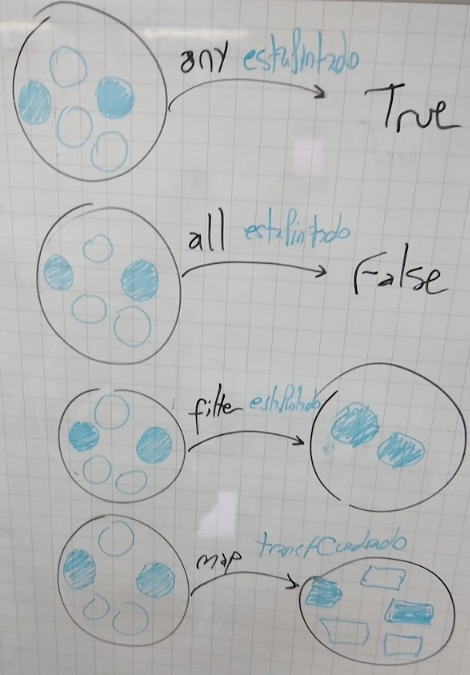

# Clase 04: Alto orden, testing y aplicación parcial
Fecha: 15/04/2025

## Material
- [Enunciado de League of Haskell](https://docs.google.com/document/d/1gDxoFhZzrQBbG0wKfgG5m-3KlfMZhzUhGkhglfT1H-Y/edit?usp=sharing)
- [Código hecho en clase con tests](https://github.com/pdepman/2025-f-altoOrden/tree/master/src)
* [Apunte](https://docs.google.com/document/d/1Rzsp5A46R_WdC-NJ6_SKrUrtZ6LmR5A52BazE9XPLIc/edit) sobre **Orden superior**.
* [Apunte](https://docs.google.com/document/d/17EPSZSw7oY_Rv2VjEX2kMZDFklMOcDVVxyve9HSG0mE/edit#heading=h.s41ggdjqkuv6) sobre **Testing**.
* [Apunte](https://docs.google.com/document/d/1n7TPE2qRpFSnj95lIZFD-q7Ko_DT9XZLH9_kEkNClrU/edit?tab=t.0) sobre **composición y aplicación parcial**.

## Tarea para la clase que viene: Entrega 1 de 2 del TP Grupal Integrador

- [Tarea del classroom](https://classroom.github.com/a/WYBI0cd7) -> **El primero que la acepte pone el nombre de grupo exactamente como lo decidieron previamente, los siguientes se suman a ese grupo**
- [Enunciado Pisteando como un campeón Entrega 1 de 2](https://docs.google.com/document/d/1KFpqK-7iY1UHnfymXrihNH7P8B9WymdiyIlS6JYDM7M/edit?usp=sharing)