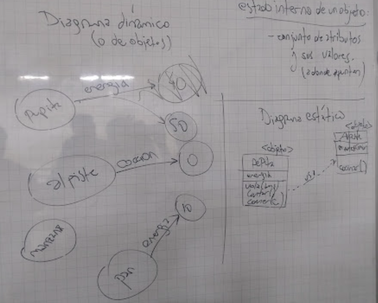
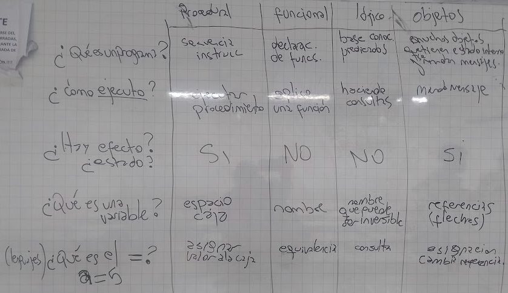

# Clase 17 - Intro a Objetos

Fecha: 02/09/2025

### Materiales que dan soporte a los temas de hoy

* Código [hecho en clase](https://github.com/pdepman/2025-o-introObjetos)
* Wiki
  * [Mensajes y métodos](https://wiki.uqbar.org/wiki/articles/mensajes-y-metodos.html)
  * [Variables](https://wiki.uqbar.org/wiki/articles/variables.html)
  * [Polimorfismo](http://wiki.uqbar.org/wiki/articles/polimorfismo-en-el-paradigma-de-objetos.html).
  * [Encapsulamiento](https://wiki.uqbar.org/wiki/articles/encapsulamiento.html).
* Apuntes 
  * [Polimorfismo](https://docs.google.com/document/d/1X7Sz12e7rbVO1x7uMD7ECjZnT-chELx0ElTPmNvNURU/edit#).
  * [Módulo 01](https://docs.google.com/document/d/1RBfNmKZFKZ90XvfQsN7zhtuUPV2Mvj7t-iyZiL2bClQ/edit?usp=drive_web): Objeto. Mensaje. Métodos.
  * [Módulo 02](https://docs.google.com/document/d/14092iRsXDXih8-q_0UEXIGRSQmGtxL9pay1VXX4ceJg/edit?usp=drive_web): Referencias. Estado. Compartir objetos. Accessors (setters y getters). Identidad.

### Tarea para la clase que viene
* [Instalación del entorno de wollok](https://www.wollok.org/getting_started/installation/).
* Trabajo Práctico Individual - [Enunciado](https://docs.google.com/document/d/1Rz_NnbapPt7iR_MvFDnOD7IUdnAUoKasZGO49qNX4RE/edit?tab=t.0) y  [Classroom](https://classroom.github.com/a/QLuYl-jD)
* [Volver a cargar los grupos](https://forms.gle/kCfmWoPYozTDf4zdA) (aunque sean los mismos)

