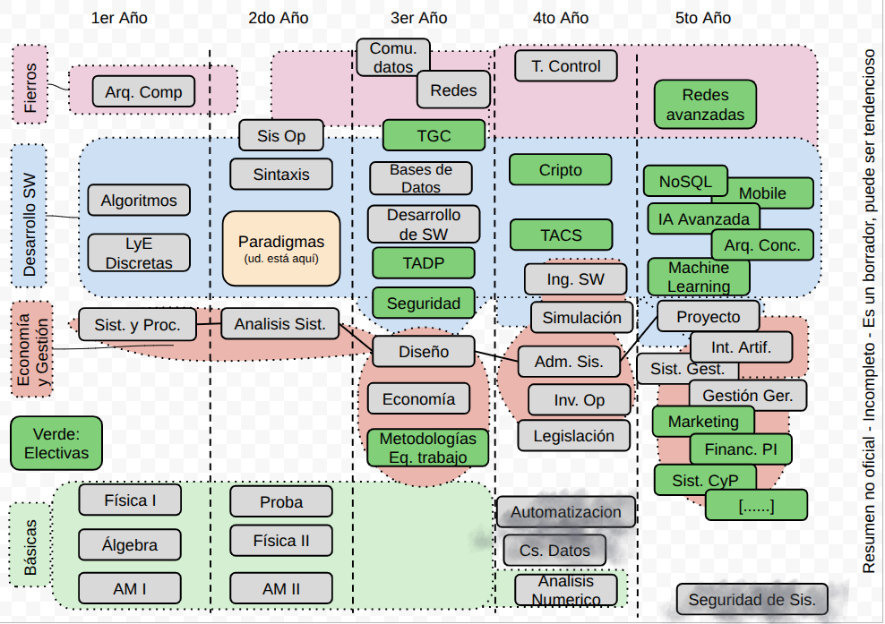

# Clase 29: Clase final

Fecha: 25/11/2025

- [Grafo materias en la carrera](https://docs.google.com/drawings/d/1pPDpJK3olIQM2epkfdzfUC2z06j2NaCuX7dzXyfHVIU/edit?usp=sharing)
- [Código hecho en clase](https://github.com/pdepman/2025-claseFinal) (comparativa de lenguajes)
- [Diapo con lenguajes y universidad](https://docs.google.com/presentation/d/1m9DWl_9kPhB7tjO_uFFx8x8N2IEZ3soTDN34icFz5AE/edit?usp=sharing)
- [Recuerden las **pautas de promoción y aprobación**](https://docs.google.com/document/d/1u8LpM5iYBO_v6YFbBHdxdIEKU2o5uV-SZ8Jpm4hqsko/edit?tab=t.0#heading=h.py01xhqbfosu) que hablamos a ppios de año
### Tarea

¿¿¿En la última clase???
Si.

- [Encuesta final](https://docs.google.com/forms/d/e/1FAIpQLSesWwnR6OFCRIufWQyF-50fUErHxBKvyM2xseouS4CTOL8K_w/viewform?usp=preview) Nos sirve mucho que llenen la encuesta. Especialmente quienes no pudieron terminar, quienes les costó más, nos sirve para aprender y mejorar el próximo curso. 

Un placer haber compartido este año con uds.

