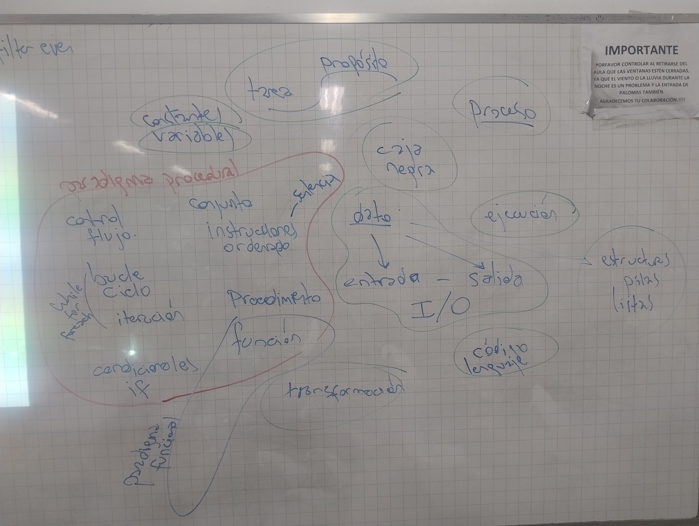
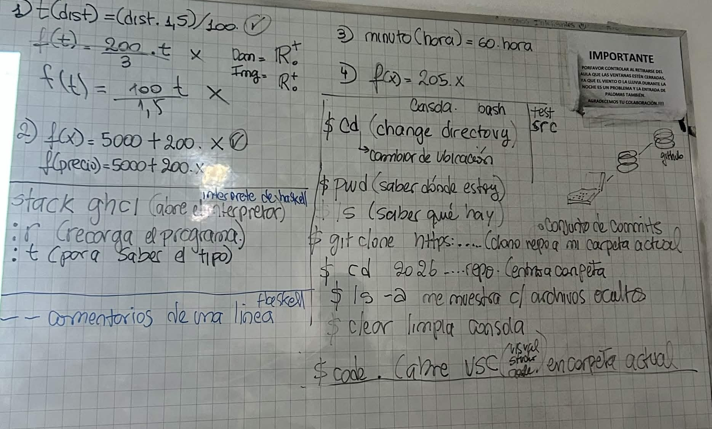
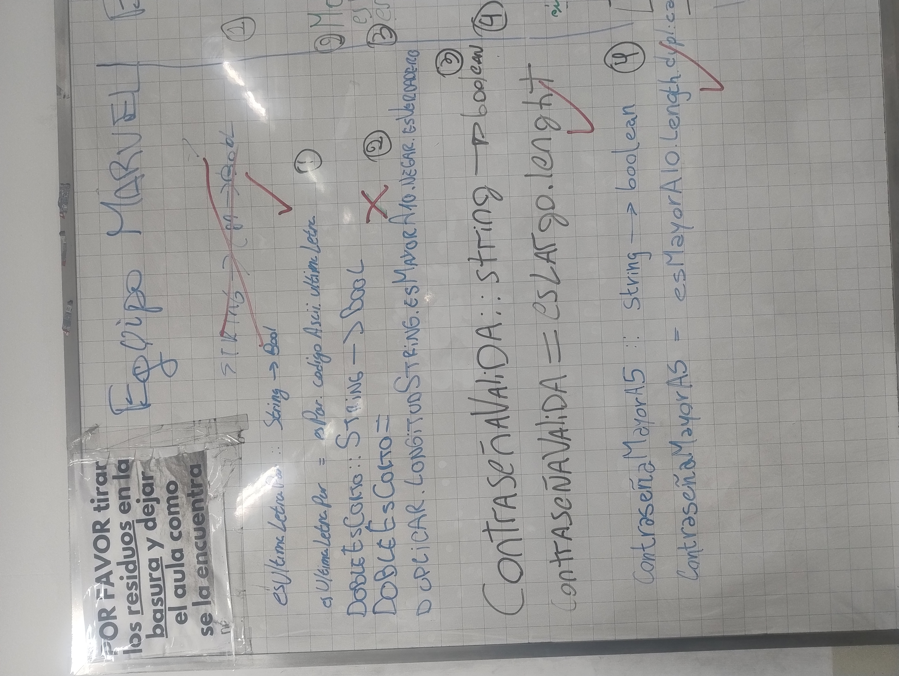
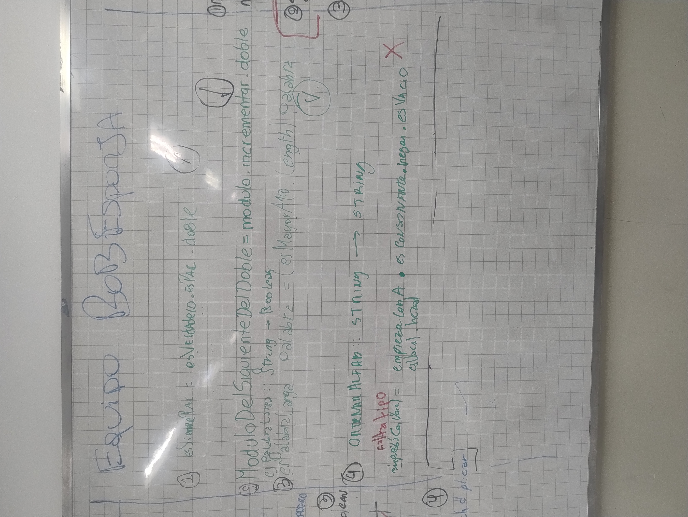
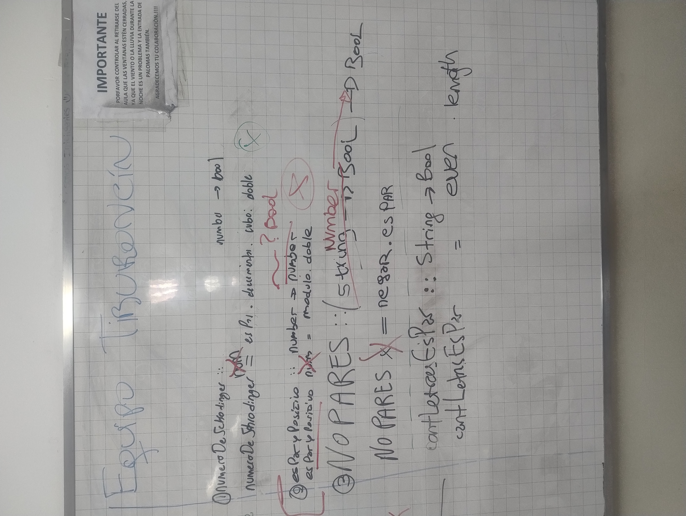

# Clase 02: Intro a funcional

Fecha: 14/04/2026

* Ejercicio de las [combis](https://drive.google.com/file/d/14NNfi4UK9LXbObCBqO5jU1G4_POdu6GT/view?usp=sharing).
* [Código hecho en clase](https://github.com/pdepman/2026-f-intro-funcional/blob/main/src/Library.hs).
* [Video](https://www.youtube.com/watch?v=WV1fPlFAw8M&ab_channel=Mumuki) 4' sobre **paréntesis** y [video](https://www.youtube.com/watch?v=ymCuneefgKU&ab_channel=Mumuki) de 3' sobre **precedencia** en Haskell.
* [Video](https://www.youtube.com/watch?v=ypPigrP7XXs&t=1202s&ab_channel=AlfSanzo) de 25' sobre **composisión**.
* Para quienes quieran saber sobre `stack` y lo que es un **Gestor de proyectos**, acá hay un [videito](https://www.youtube.com/watch?v=FCwwOM_7jZo&ab_channel=Fundaci%C3%B3nUqbar) de 12'.
* Recuerden que también están los [Apuntes sobre funcional](https://www.pdep.com.ar/material/apuntes#h.niewwea73vw) y [la wiki](https://wiki.uqbar.org/wiki/articles/paradigmas-de-programacion.html)

### Tarea para la clase que viene

* Con lo que vimos ya pueden hacer la práctica 2 de [Miyuki](https://miyuki.com.ar) hasta el ejercicio de pinos.
* Ese ejercicio lo vamos a estar resolviendo la clase que viene asi que recomendamos que lo traigan ya pensado.
* [Enunciado pinos](https://docs.google.com/document/d/1Lk9aKM2RE-xLgrdbHXa4nxoR9DhsUKRAs2UVDbtnmF0/edit?usp=sharing)
* Si no lo resuelven en miyuki tambien pueden [iniciar un nuevo proyecto](https://pdepre.ludat.io/guides/nuevo_proyecto/) o clonar el repositorio con el codigo hecho en clase

