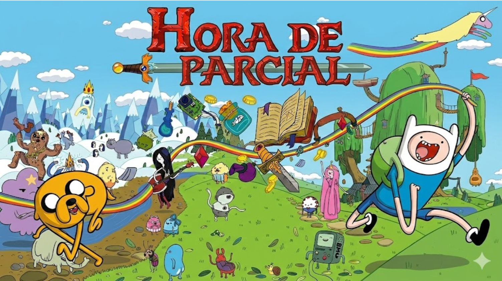

# ⭐ Bitácora 08: Posible Resolución del Parcial del paradigma Funcional ⭐

## 📝 Enunciado
Pueden repasar el enunciado del parcial en el siguiente enlace:
📄 **[Link al Enunciado del Parcial](https://github.com/pdepman/2026-f-resolucion-parcial/blob/main/src/0_PdepMan%202026%20-%20Parcial%20Funcional%20-%20Hora%20de%20Parcial%20.pdf)**

## 💡 Código de una posible la Resolución
💻 **[Ver código de la resolución](https://github.com/pdepman/2026-f-resolucion-parcial/blob/main/src/Library.hs)**

## Aclaración 🌸
Es una posible resolución al parcial, pudieron haberlo resuelto de otras muchas formas y estar bien igualmente.

## 💬 Dudas
Como siempre, si tienen alguna consulta nos escriben por Discord 🩷.
